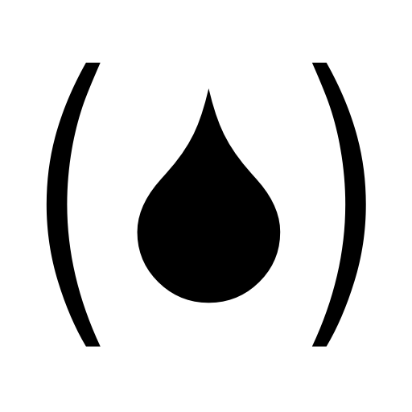

# fuel-lang == FUEL(isp)
FUEL(isp) is a fast usable embeddable lisp interpreter (currently for the .NET platform and native C++). 
FUEL was original written in C# and C++. This project is a port to the [Haxe language](https://haxe.org/).

For further documentation see the [original project page](https://github.com/mneuroth/fuel-lang).

Benchmark results on Windows 11 Dell XPS 17 with i7-11800H CPU:

| Executable         | Platform           | benchmark.fuel [s] |
|---                 |---                 |---                 |
| Fuel.exe           | Windows C# native  |  0.8               |
| Fuel.exe           | Windows C++ native |  1.7               |
|                    |                    |                    |
| Fuel.exe           | Windows Haxe_C#    |  5.6               |
| FuelCpp.exe        | Windows Haxe_C++   |  0.7               |
| java -jar fuel.jar | Windows Haxe_java  |  3.6               |
| python fuel.py     | Windows Haxe_py    | 95.4               |
| neko fuel.n        | Windows Haxe_neko  | 30.0               |
|                    |                    |                    |
| Fuel.exe           | WSL Haxe_C#        |  5.7               |
| FuelCpp.exe        | WSL Haxe_C++       |  1.3               |
| java -jar fuel.jar | WSL Haxe_java      |  5.1               |
| python fuel.py     | WSL Haxe_py        | 87.5               |
| neko fuel.n        | WSL Haxe_neko      | 41.7               |
| HashLink           | WSL Haxe_hl        |  6.4               |

License
-------
FUEL is released under the MIT license:

>  FUEL(isp) is a fast usable embeddable lisp interpreter.
>  
>  Copyright (c) 2016-2023 Michael Neuroth
>
>  Permission is hereby granted, free of charge, to any person obtaining
>  a copy of this software and associated documentation files (the "Software"),
>  to deal in the Software without restriction, including without limitation
>  the rights to use, copy, modify, merge, publish, distribute, sublicense,
>  and/or sell copies of the Software, and to permit persons to whom the
>  Software is furnished to do so, subject to the following conditions:
>
>  The above copyright notice and this permission notice shall be included
>  in all copies or substantial portions of the Software.
>
>  THE SOFTWARE IS PROVIDED "AS IS", WITHOUT WARRANTY OF ANY KIND, EXPRESS
>  OR IMPLIED, INCLUDING BUT NOT LIMITED TO THE WARRANTIES OF MERCHANTABILITY,
>  FITNESS FOR A PARTICULAR PURPOSE AND NONINFRINGEMENT. IN NO EVENT SHALL
>  THE AUTHORS OR COPYRIGHT HOLDERS BE LIABLE FOR ANY CLAIM, DAMAGES OR
>  OTHER LIABILITY, WHETHER IN AN ACTION OF CONTRACT, TORT OR OTHERWISE,
>  ARISING FROM, OUT OF OR IN CONNECTION WITH THE SOFTWARE OR THE USE OR
>  OTHER DEALINGS IN THE SOFTWARE.
